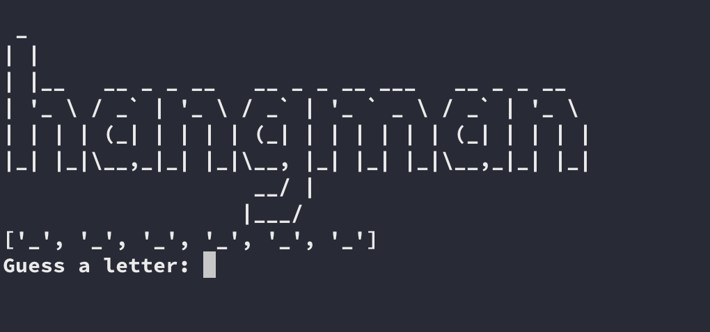
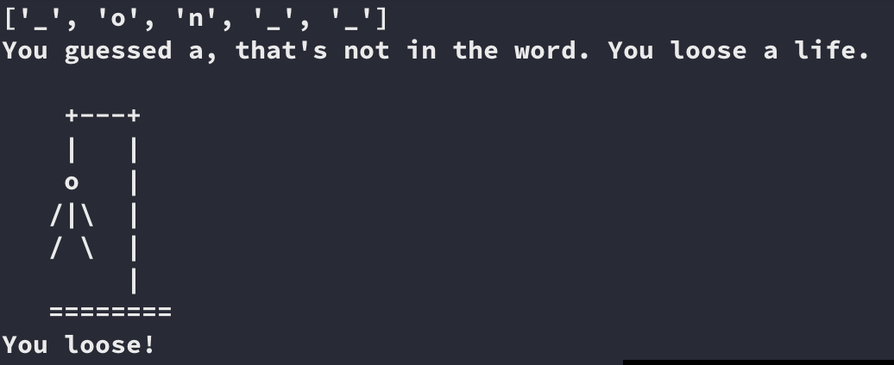

# [Hangman (game)](https://en.wikipedia.org/wiki/Hangman_(game))
In this game, there is a list of words present, out of which our interpreter will choose 1 random word. The user first has to input their names and then, will be asked to guess any alphabet. 
If the random word contains that alphabet, it will be shown as the output(with correct placement) else the program will ask you to guess another alphabet. User will be given 12 turns(can be changed accordingly) to guess the complete word.
### To start the game go inside project folder and type
* `pipenv shell`
* `pipenv install`
* `python hangman.py`

Sample words for the game are present in a file : list.txt

