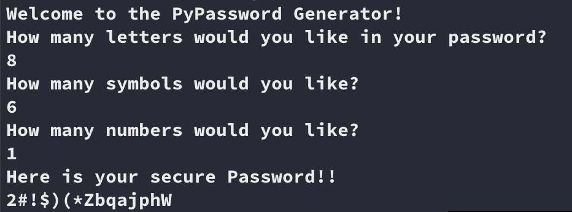

# Generating Strong Password using Python
This program uses a mixture of numbers, alphabets, and other symbols found on the computer keyboard to form strong password which is unpredictable and cannot easily be memorized.
Here, numbers, alphabets, and other symbols are selected randomly along with their positions.

### To start the game go inside project folder and type `python password_generator.py`

