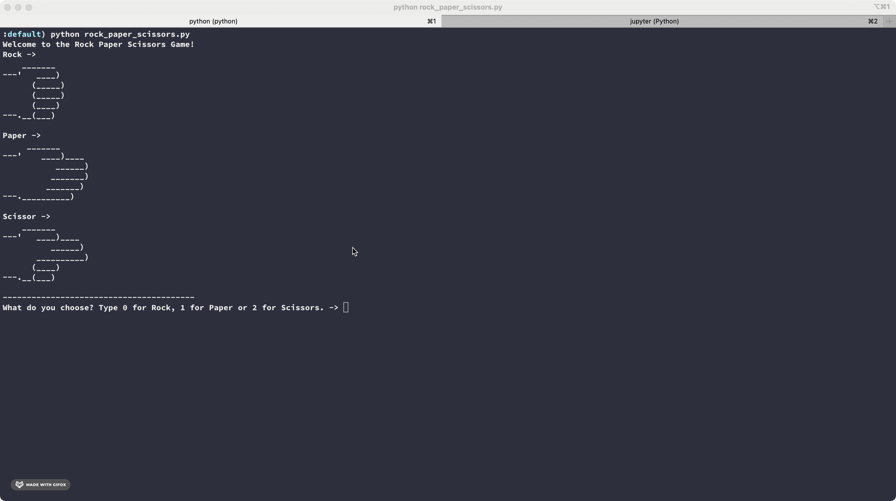
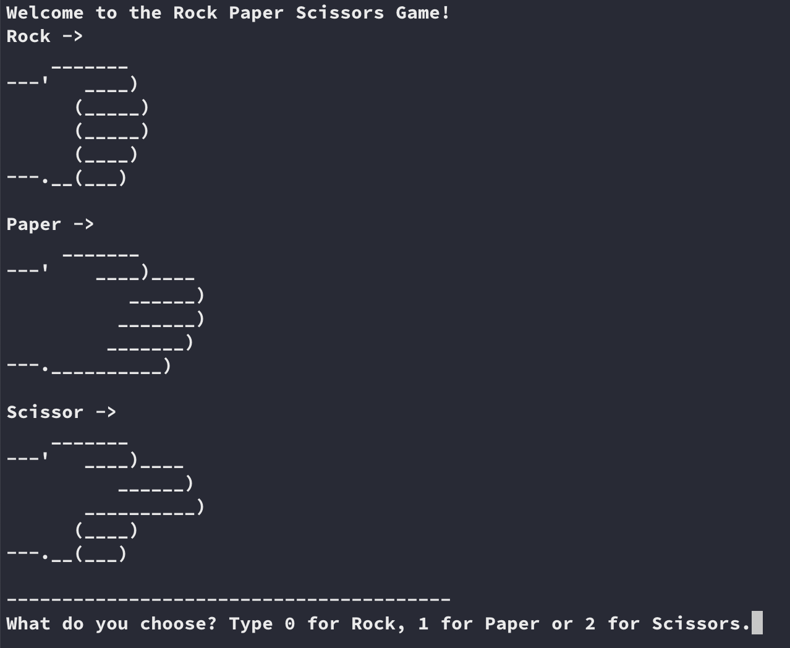
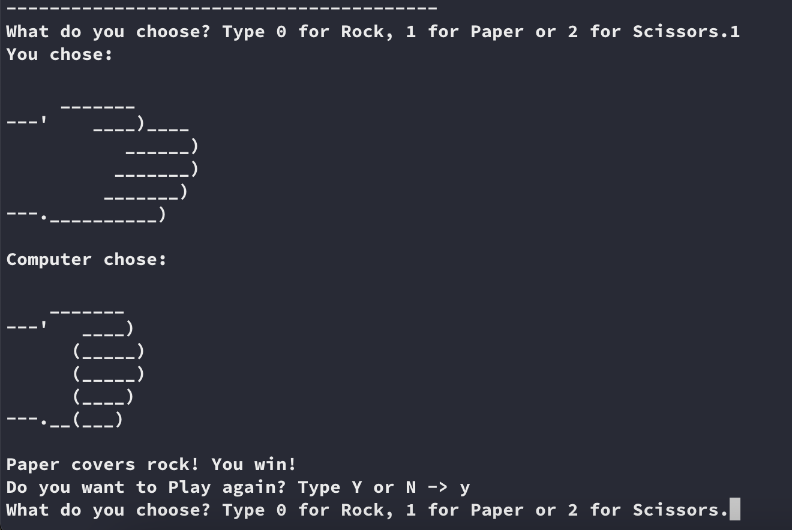

# Rock paper scissors
[Rules](https://wrpsa.com/the-official-rules-of-rock-paper-scissors/)

Rock paper scissors (also known by other orderings of the three items, with "rock" sometimes being called "stone", or as Rochambeau, roshambo, or ro-sham-bo)[1][2][3] is a hand game, usually played between two people, in which each player simultaneously forms one of three shapes with an outstretched hand. These shapes are "rock" (a closed fist), "paper" (a flat hand), and "scissors" (a fist with the index finger and middle finger extended, forming a V). "Scissors" is identical to the two-fingered V sign (also indicating "victory" or "peace") except that it is pointed horizontally instead of being held upright in the air.

To start the game go inside project folder and type `python rock_paper_scissors.py`

