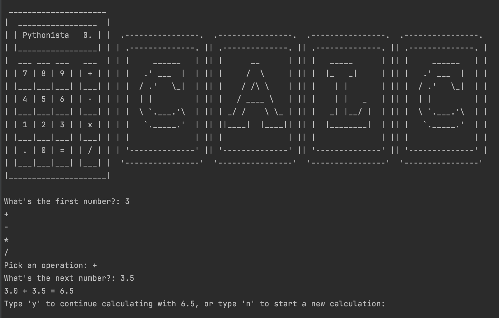

# Calculator

Simple Calculator written in Python. User can enter the numbers and select the operator from the given list to perform the operation.

### To start the game go inside project folder and type
* `pipenv shell`
* `pipenv install`
* `python calculator.py`

