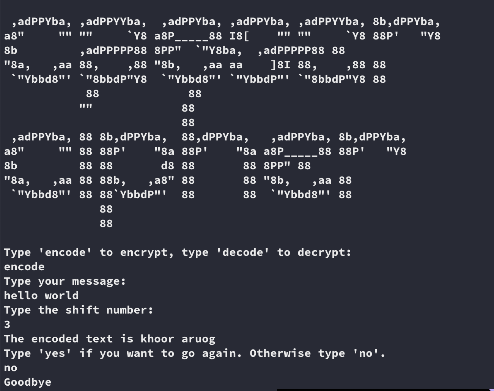

# Caesar Cipher
This program can be used to encode decode a message provided by user. Message with will be encoded or decoded using the shift number provided by user. 
It will encode/decode all the alphabet characters in the message and keep the others characters as is.

### To start the game go inside project folder and type `python caesar-cipher.py`

