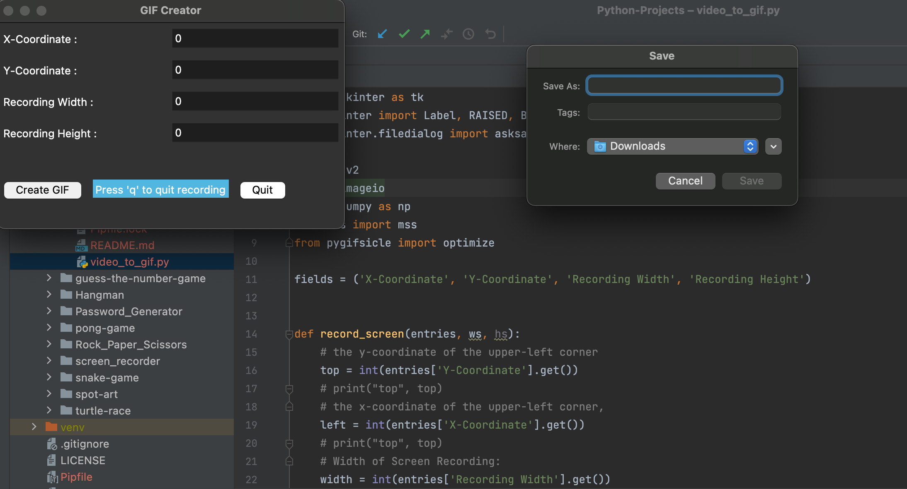
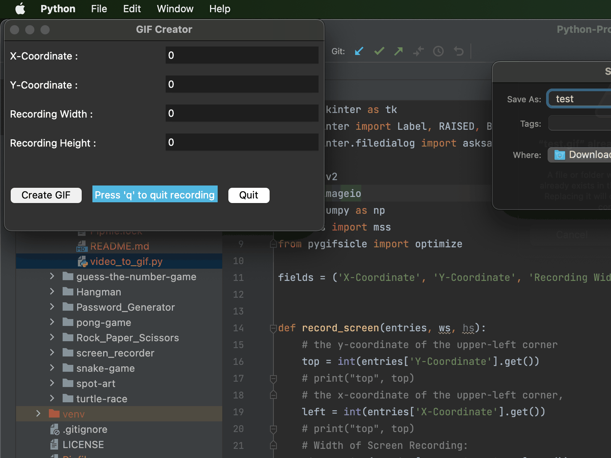
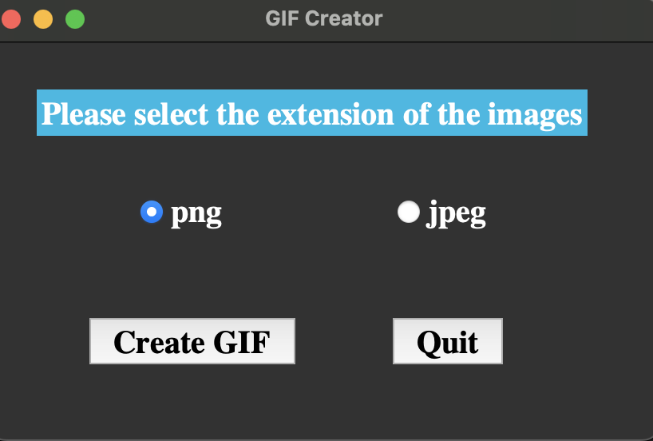

# GIF Creator
Graphics Interchange Formats, GIFs, are a series of animated images that give a sense of motion.
These are being used by most people to communicate with others on social media platforms like WhatsApp, Instagram, etc. Here we will be building a GIF Creator that creates a GIF using Python.

### An Ultra fast cross-platform GIF Creator builds with
* `Python 3.9`
* `imageio`
* `opencv-python`
* `pillow`
* `mss`
* `pygifsicle`

#### Before creating GIF, we need to install all the dependencies.Below command can be used to install all the dependencies.

* `pipenv shell`
* `pipenv install`

1. To create optimized GIF from live recording follow the below steps.

* Users can select portion of the screen to record using x,y coordinates along with screen width,height.
* Users can select the location where the GIF will be stored.

`python video_to_gif.py`

2. To create optimized GIF using list of images follow the below steps.

* Users can select the folder where images are stored.
* Users can select the image extension either as 'png' or 'jpeg'.

`python image_to_gif.py`

