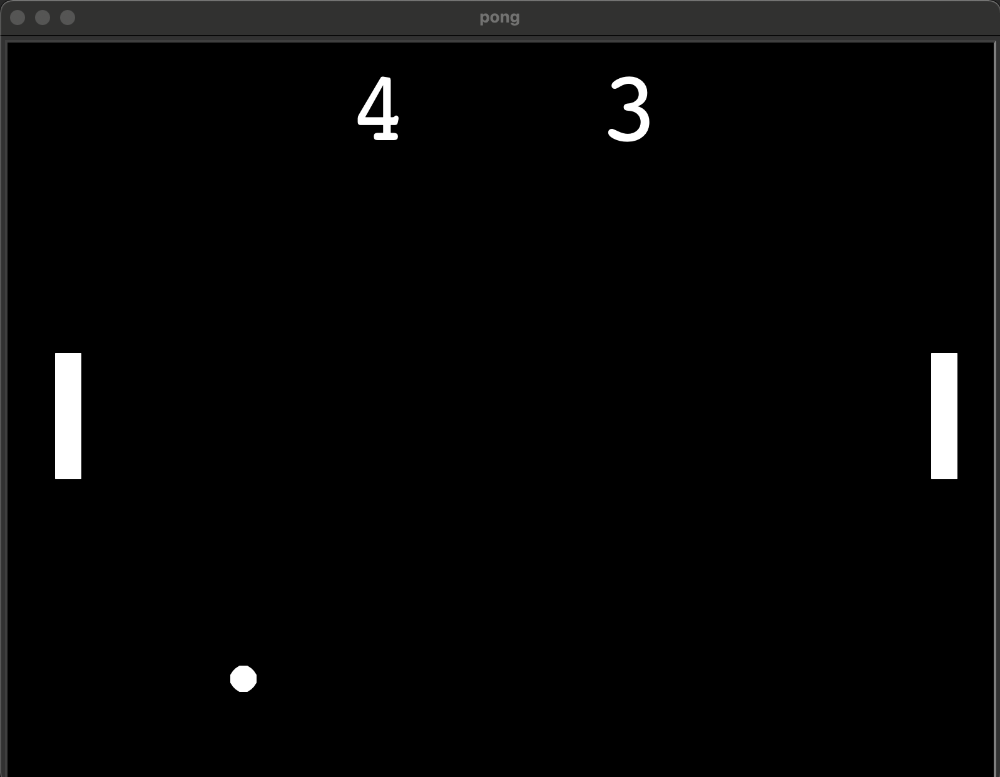
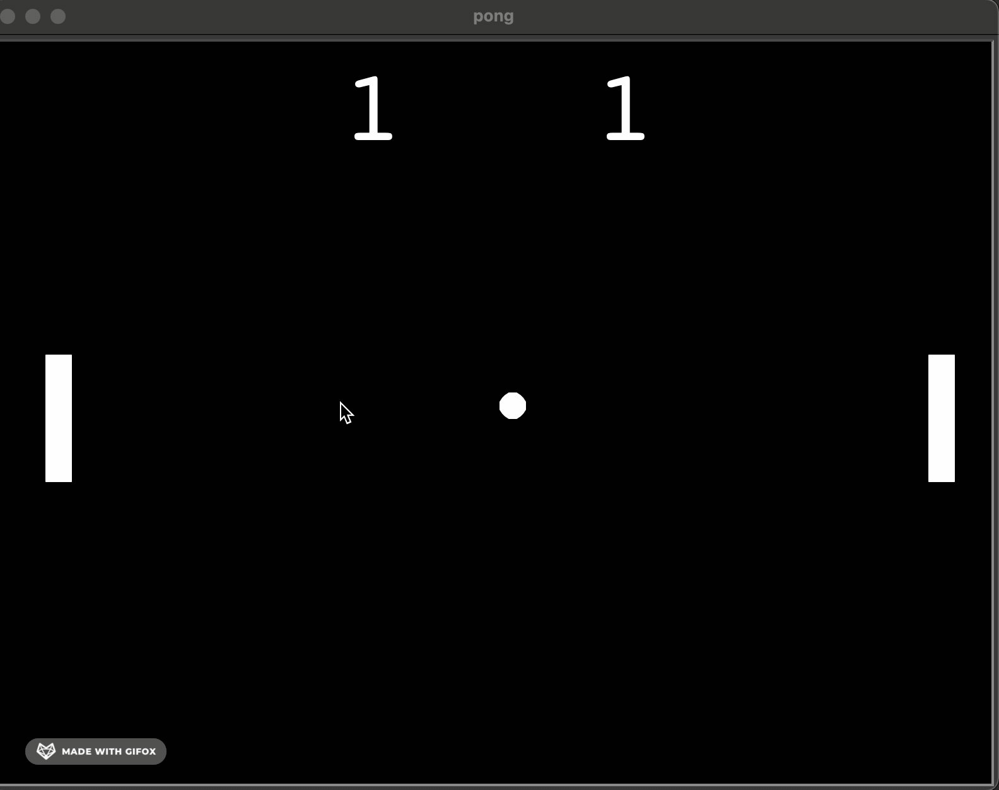

# Pong Game

Pong is one of the most famous arcade games, simulating table tennis. Each player controls a paddle in the game by dragging it vertically across the screen’s left or right side. Players use their paddles to strike back and forth on the ball.

Turtle is an inbuilt graphic module in Python. It uses a panel and pen to depict illustrations.
### To start the game go inside project folder and type
* `pipenv shell`
* `pipenv install`
* `python pong.py`

