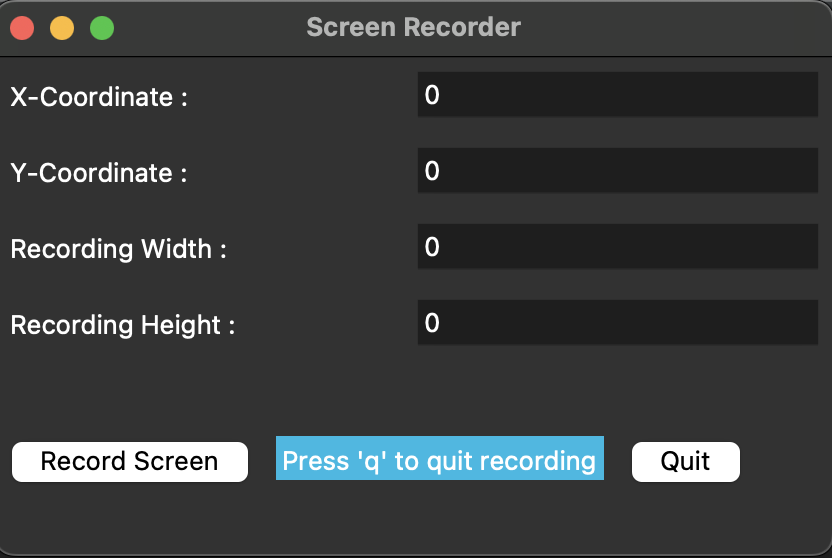

# Screen Recorder
Screen recording enables you to create demonstration videos, record gaming achievements, and create videos that can be shared online on social media.

### An Ultra fast cross-platform screen recorder build with
* `Python 3.9`
* `numpy`
* `opencv-python`
* `pillow`
*  `mss`

Users can select portion of the screen to record using x,y coordinates along with screen width,height.

### To record the video go inside project folder and type
* `pipenv shell`
* `pipenv install`
* `python screen_recorder.py`

