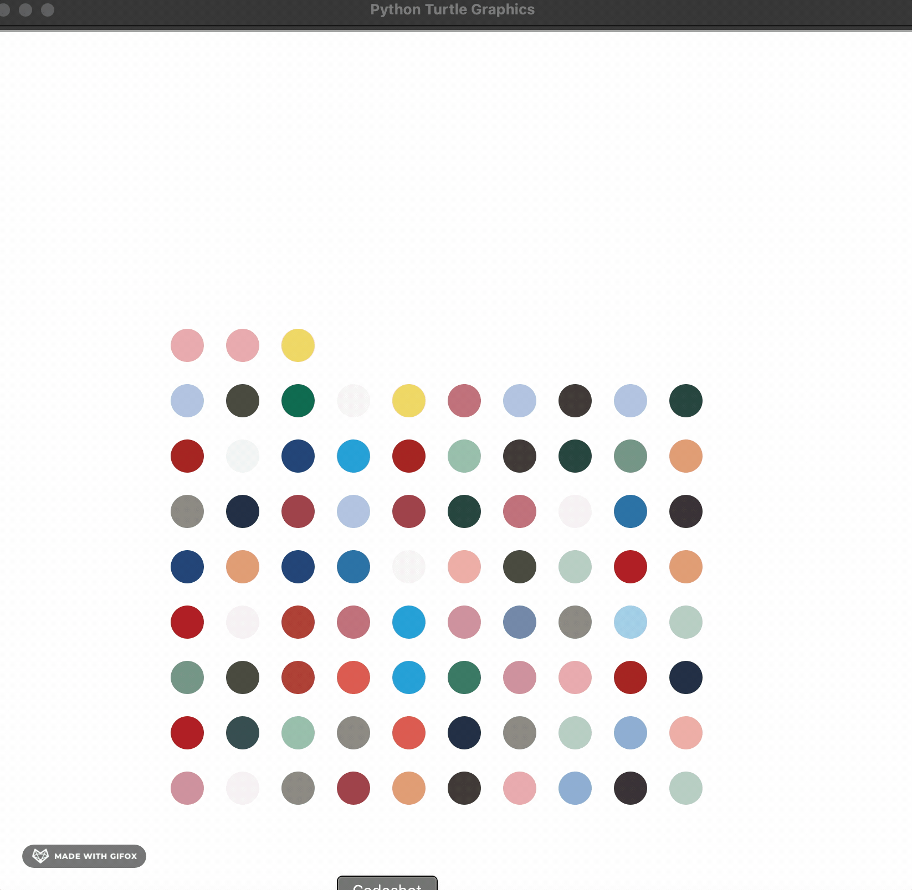

# Spot Painting

[Hirst Spot Painting](https://www.artsy.net/artist-series/damien-hirst-spots) -> This project demonstrate , how to create a spot painting 
using [Turtle](https://docs.python.org/3/library/turtle.html#) and [Colorgram](https://pypi.org/project/colorgram.py/)

### To start the painting go inside project folder and type
* `pipenv shell`
* `pipenv install`
* `python painting.py`

